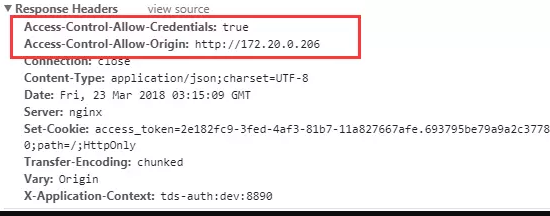
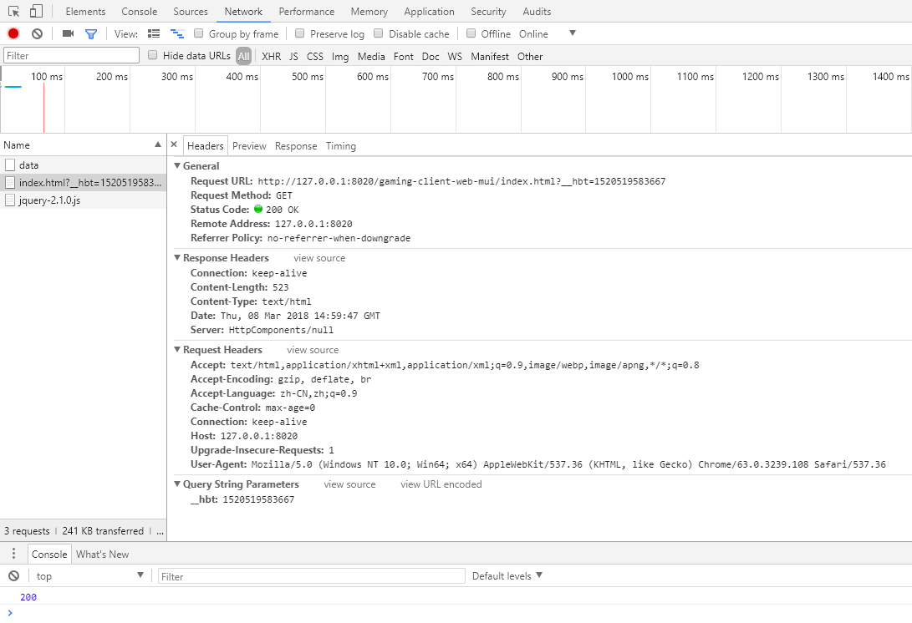

## 一、什么是跨域问题

在浏览器端进行 Ajax 请求时会出现跨域问题，那么什么是跨域，如何解决跨域呢？先看浏览器端出现跨域问题的现象，如下图所示


### 1.什么是跨域问题？

跨域，指的是浏览器不能执行其他网站的脚本。它是由浏览器的同源策略造成的，是浏览器对 JavaScript 施加的安全限制。

### 2.什么是同源？

所谓同源是指，域名，协议，端口均相同

- http://www.qf.com/ –> http://admin.qf.com/ 跨域
- http://www.qf.com/ –> http://www.qf.com/ 非跨域
- http://www.qf.com/ –> http://www.qf.com:8080/ 跨域
- http://www.qf.com/ –> https://www.qf.com/ 跨域

### 3.如何解决跨域问题？

#### 1)使用 CORS（跨资源共享）解决跨域问题

CORS 是一个 W3C 标准，全称是”跨域资源共享”（Cross-origin resource sharing）。它允许浏览器向跨源服务器，发出 XMLHttpRequest 请求，从而克服了 AJAX 只能同源使用的限制。

CORS 需要浏览器和服务器同时支持。目前，所有浏览器都支持该功能，IE 浏览器不能低于 IE10。整个 CORS 通信过程，都是浏览器自动完成，不需要用户参与。对于开发者来说，CORS 通信与同源的 AJAX 通信没有差别，代码完全一样。浏览器一旦发现 AJAX 请求跨源，就会自动添加一些附加的头信息，有时还会多出一次附加的请求，但用户不会有感觉。因此，实现 CORS 通信的关键是服务器。只要服务器实现了 CORS 接口，就可以跨源通信（在 `header` 中设置：`“Access-Control-Allow-Origin”`，“*”）

#### 2)使用 JSONP 解决跨域问题

JSONP（JSON with Padding）是 JSON 的一种“使用模式”，可用于解决主流浏览器的跨域数据访问的问题。由于同源策略，一般来说位于 `server1.example.com`的网页无法与 `server2.example.com` 的服务器沟通，而 HTML 的 `<script>` 元素是一个例外。利用 `<script>` 元素的这个开放策略，网页可以得到从其他来源动态产生的 JSON 资料，而这种使用模式就是所谓的 JSONP。用 JSONP 抓到的资料并不是 JSON，而是任意的 JavaScript，用 JavaScript 直译器执行而不是用 JSON 解析器解析（需要目标服务器配合一个 `callback` 函数）。

#### 3)CORS 与 JSONP 的比较

CORS 与 JSONP 的使用目的相同，但是比 JSONP 更强大。

JSONP 只支持 GET 请求，CORS 支持所有类型的 HTTP 请求。JSONP 的优势在于支持老式浏览器，以及可以向不支持 CORS 的网站请求数据。

#### 4)使用 Nginx 反向代理解决跨域问题

以上跨域问题解决方案都需要服务器支持，当服务器无法设置 `header` 或提供 `callback` 时我们就可以采用 Nginx 反向代理的方式解决跨域问题。

Nginx 配置跨域案例，在 `nginx.conf` 的 `location` 中增加如下配置：

```
add_header Access-Control-Allow-Origin *或域名;
add_header Access-Control-Allow-Headers X-Requested-With;
add_header Access-Control-Allow-Methods GET,POST,OPTIONS;
```

如：

```
user  nginx;
worker_processes  1;

events {
    worker_connections  1024;
}

http {
    include       mime.types;
    default_type  application/octet-stream;

    sendfile        on;

    keepalive_timeout  65;

    server {
        listen 80;
        server_name 192.168.75.128;
        location / {
            add_header Access-Control-Allow-Origin *;
            add_header Access-Control-Allow-Headers X-Requested-With;
            add_header Access-Control-Allow-Methods GET,POST,OPTIONS;

            root /usr/share/nginx/wwwroot/cdn;
            index index.jsp index.html index.htm;
        }
    }
}
```


## 二、SpringMVC 配置 CORS

```XML
<mvc:cors>  
    <mvc:mapping path="/**"
        allowed-origins="*"
        allowed-methods="POST, GET, OPTIONS, DELETE, PUT,PATCH"
        allowed-headers="Content-Type, Access-Control-Allow-Headers, Authorization, X-Requested-With"
        allow-credentials="true" />
</mvc:cors>
```

在spring-mvc.xml中加入上述这一段。其中，allowed-origins指的是允许的访问源的域名，"*"表示任何人都可以访问，也可以指明具体的域名，比如下图：




## 三、拦截器的方式配置解决跨域

```java
import lombok.extern.slf4j.Slf4j;
import org.springframework.web.servlet.HandlerInterceptor;
import org.springframework.web.servlet.ModelAndView;

import javax.servlet.http.HttpServletRequest;
import javax.servlet.http.HttpServletResponse;

@Slf4j
public class CorsInterceptor implements HandlerInterceptor {

    @Override
    public boolean preHandle(HttpServletRequest request, HttpServletResponse response, Object o) throws Exception {
        System.out.println("CorsInterceptor.preHandle");
        return true;
    }

    @Override
    public void postHandle(HttpServletRequest request, HttpServletResponse response, Object o, ModelAndView modelAndView) throws Exception {
        // Access-Control-Allow-Origin
        String origin = request.getHeader("Origin");
        System.out.println("origin.........."+origin);

        response.setHeader("Access-Control-Allow-Origin", origin);
        response.setHeader("Vary", "Origin");

        // Access-Control-Max-Age
        response.setHeader("Access-Control-Max-Age", "3600");

        // Access-Control-Allow-Credentials
        response.setHeader("Access-Control-Allow-Credentials", "true");

        // Access-Control-Allow-Methods
        response.setHeader("Access-Control-Allow-Methods", "POST, GET, OPTIONS, DELETE");

        // Access-Control-Allow-Headers
        response.setHeader("Access-Control-Allow-Headers",
                "Origin, X-Requested-With, Content-Type,Accept,X-Custom-Header,Set-Cookie");


    }

    @Override
    public void afterCompletion(HttpServletRequest httpServletRequest, HttpServletResponse httpServletResponse, Object o, Exception e) throws Exception {
        System.out.println("CorsInterceptor.afterCompletion");
    }
}

```


## 四、Spring Boot 配置 CORS

### 1.使用 Java 配置的方式

```java
/**
 * 跨域配置
 * <p>Title: CorsConfiguration</p>
 * <p>Description: </p>
 */
@Configuration
public class CORSConfiguration extends WebMvcConfigurerAdapter {
    @Override
    public void addCorsMappings(CorsRegistry registry) {
        registry.addMapping("/**").allowedOrigins("*")
                .allowedMethods("GET", "HEAD", "POST", "PUT", "DELETE", "OPTIONS")
                .allowCredentials(false).maxAge(3600);
    }
}
```

### 2.使用注解的方式

```
@CrossOrigin(origins = "*", maxAge = 3600)
```

### 3.解决跨域后的效果图

